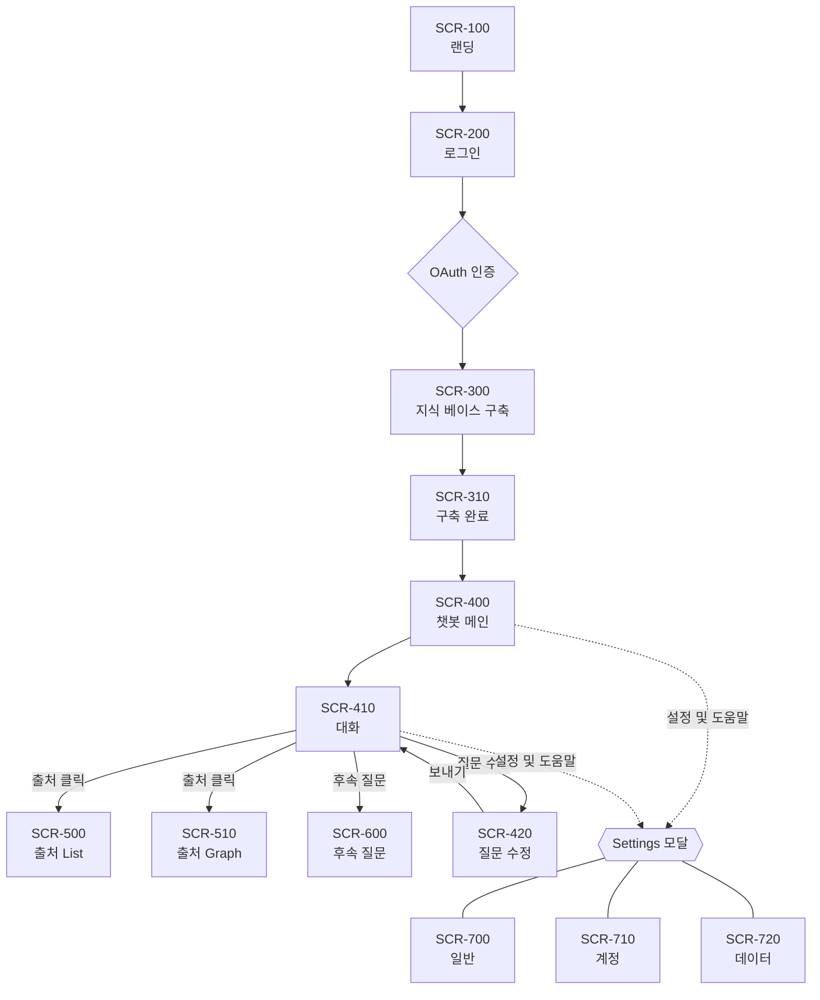

# Frontend AGENTS

## Project
LINA — Confluence 기반 RAG 검색/응답 시스템 (Vue 3 SPA)

## Tech Stack
- Vue 3 + Vite + TypeScript
- Pinia / Vue Router / Tailwind CSS
- 새 UI 라이브러리 추가 금지 (package.json 외)

## Reference Docs
작업 목적에 따라 아래 우선 확인 문서를 확인한다.
> 경로는 모두 **프로젝트 루트 기준**이다.

| 목적 | 경로 |
|---|---|
| API 명세 | `/docs/api-spec.md` |
| 아키텍처 | `/docs/architecture.md` |
| 화면별 컴포넌트 상세 구현 | `/frontend/docs/components.md` |
| Frontend 코딩 규칙 | `/frontend/docs/code-reference.md` |
| Design system reference | `/frontend/docs/design-reference.css` |
| UI design for each frame  | `/frontend/docs/frames/` |
| 전체 UI 흐름 파악 | `/frontend/docs/ui-spec.pdf` |
| Confluence 원본 샘플 | `/mock-data/confluence_sample_data.json` |

## Implementation Order
1. **Chat** (SCR-400 ~ 600) — mock 데이터로 먼저
2. **Auth / Onboarding** (SCR-100 ~ 310)
3. **Settings 모달** (SCR-700 ~ 720)

## Screen Flow

## Hard Rules

### 작업 시작 전 (화면/컴포넌트 구현 시)
구현을 시작하기 전 **반드시** 아래 순서로 확인한다. 절차 없이 임의로 만들지 않는다.

1. `/frontend/docs/components.md` → 해당 화면/컴포넌트의 동작 사양
2. `/frontend/docs/frames/{screen-id}.png` → 디자인 시안
3. `/frontend/docs/design-reference.css` → 사용할 디자인 토큰 참고
4. `/docs/api-spec.md` → 필요한 API 응답 구조
5. 의문점이 있으면 코드 작성 전 확인 요청

### 코드 작성 시 (항상)
- 디자인 토큰은 `design-reference.css` 참고, Tailwind config에 등록해 사용 — 임의 색상 금지
- 답변·검색 결과에는 항상 **출처 / 작성일자 / 작성자** 노출
- 비동기 컴포넌트는 로딩 / 에러 / 빈 상태 모두 처리
- 그 외 세부 코딩 규칙은 `/frontend/docs/code-reference.md` 준수